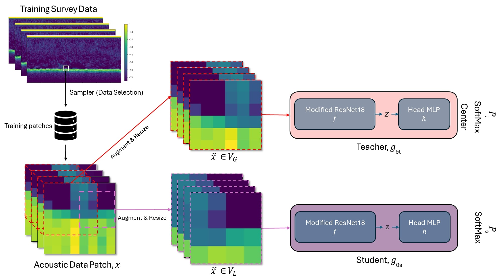

# Self-Supervised Feature Learning for Acoustic Data Analysis

This repository contains the implementation of self-supervised learning methods for acoustic data analysis, focusing on fisheries echosounder data. The primary goal of this study was to develop a deep learning model inspired by the DINO architecture to extract acoustic features without requiring manual annotations. The model was trained using multiple data sampling strategies to address class imbalance and improve the discriminative power of features in downstream tasks such as classification and regression.

## Main Model Overview

*Figure: Overview of the self-supervised learning model applied in the study.*

## Repository Structure

## Prerequisites

- numpy~=1.26.2
-  matplotlib~=3.8.2
- pandas~=2.1.4
- scipy~=1.13.1
- torch~=2.5.0
- PyYAML~=6.0.1
- Pillow~=10.1.0
- scikit-learn~=1.5.2
- tqdm~=4.66.5
- requests~=2.31.0

## Usage

## Data Availability

The datasets used in this project are securely stored on servers managed by the Institute of Marine Research (IMR). Due to the large size of the dataset, access can be requested by contacting the corresponding author for an S3 access token. Please refer to the manuscript for detailed information on the dataset.

## Contact

For questions or collaboration inquiries, please reach out to the corresponding author, Ahmet Pala.
