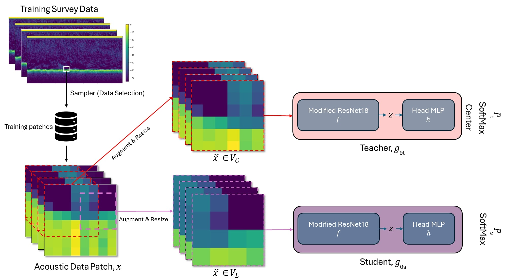

# Self-supervised feature learning for acoustic data analysis

This repository contains the implementation of self-supervised learning methods for acoustic data analysis, focusing on fisheries echosounder data. The primary goal of this study was to develop a deep learning model inspired by the DINO architecture to extract acoustic features without requiring manual annotations. The model was trained using multiple data sampling strategies to address class imbalance and improve the discriminative power of features in downstream tasks such as classification and regression.

## Main model overview

This repository implements a Self-Supervised Learning (SSL) model designed specifically for acoustic data analysis. The training process involves the following steps:

1. **Data preparation**: Extract acoustic data patches from the training dataset using a predefined sampling scheme to form the training set.
2. **View generation**: For each patch `x`, generate two global views and eight local views, forming sets `V_G` and `V_L`. The views are chosen in pairs from the combined set `V` for training.
3. **Network assignment**:
   - The **teacher network** receives only global views (`V_G`).
   - The **student network** can receive both global and local views (`V`).
4. **Training mechanism**: The teacher and student networks align their outputs by minimizing the dissimilarity between the chosen views.
5. **Parameter updates**:
   - **Student network** parameters (`θ_s`) are updated using the AdamW optimizer.
   - **Teacher network** parameters (`θ_t`) are updated using an exponential moving average (EMA) technique.

*Figure: Overview of the self-supervised learning model applied in the study.*

## Repository structure

- **batch/**: Contains submodules for organizing batch processing and data transformation tasks. Key subfolders include:

  - **data_augmentation/**: Houses scripts that perform various data augmentation techniques to improve model generalization.
  - **data_transforms/**: Contains scripts for performing transformations on input data to prepare it for training.
  - **label_transforms/**: Scripts focused on transforming and handling label data appropriately.
  - **samplers/**: Contains modules for defining custom sampling strategies used during training.
- **data/**: Includes Python modules responsible for reading and managing datasets. This folder contains utility scripts used for handling data from external sources or preprocessed files:

  - **data_reader.py**: Script for reading and parsing raw data files.
  - **dataloaders.py**: Contains functions to create data loaders for efficient batch processing during training.
  - **partition.py**: Helps split datasets based on a specified partitioning scheme.
- **Jupyter_Notebooks/**: Contains Jupyter notebooks for demonstrating and documenting different steps in the training, testing, and analysis processes. Key notebooks include:

  - **Training_Data_Creation/**: Contains notebook related to generating training datasets and conducting experiments.
  - **Final_Tests.ipynb**: Evaluates model performance and provides visual insights into the results.
  - **Echogram_Painting_Code.ipynb**: Notebooks for visualizing echograms with labeled regions or features of interest.
  - **UNET_Predictions_Reading.ipynb**: A notebook to read and evaluate the predictions made by the UNet model.
- **utils_unet/**: Contains utility scripts and helper functions that support model development and data processing tasks.
- **Modules Outside Main Folders**

  - **Labeling_Survey_Patches.py**: Assigns labels to survey patches for creating labeled datasets.
  - **main_dino_acoustic_FixedData.py**: Implements the DINO-inspired SSL model and manages the main training loop.
  - **modified_resnet_*.py**: Defines customized ResNet architectures for extracting acoustic features with varying output configurations.
  - **extract_features_acoustic_FixedData.py**: Extracts features from acoustic datasets using the trained self-supervised model for downstream tasks.

## Prerequisites

- numpy~=1.26.2
- matplotlib~=3.8.1
- xarray~=0.20.0
- pandas~=1.2.3
- scipy~=1.11.3
- torch~=2.0.1
- PyYAML~=6.0.1
- Pillow~=10.0.1
- torchvision~=0.16.1
- tqdm~=4.66.1
- joblib~=1.3.2
- scikit-learn~=1.3.2
- zarr~=2.6.1
- numcodecs~=0.12.1
- opencv-python~=4.8.1.78
- requests~=2.28.1
- scikit-image~=0.22.0

## Usage

1. **Labeling non-overlapping patches**: Use the `Labeling_Survey_Patches.py` script to assign labels to patches created from each survey data. This prepares the metadata containing the center coordinates and average Sv values for intensity-based sampling and training tasks.
2. **Training data creation**: Run the Jupyter notebook in `Training_Data_Creation/` to identify the center coordinates and survey year of patches selected based on intensity-based sampling scheme.
3. **Extracting training data patches**: Use the script `Producing_Training_Data_Python_IntensityBased2.py` to extract data patches based on specified criteria, preparing them for model training.
4. **Training SSL model**: Train the model using `main_dino_acoustic_FixedData.py`. This script initiates the training process and saves the trained model.
5. **Feature extraction**:

   - **Produce data patches**: For specific survey year, generate test patches by running scripts such as `Producing_Annotation_Patches_Test_Data_2017_Python.py`.
   - **Extract and save features**: Run `extract_features_acoustic_FixedData.py` to extract features from patches based on the trained model.
6. **Model evaluation**:

   - **Test results and visualizations**: Run `Final_Tests.ipynb` to assess model performance and visualize key results.
   - **Evaluate raw data**: Use `Testing_Pixel_Based_KNN.ipynb` to analyze the model’s results on raw acoustic data.
   - **UNET results**: Run `UNET_Predictions_Reading.ipynb` to view and analyze predictions from the UNET model.

- **Note:** Before running the scripts, make sure to update the data directory paths as needed in each script or notebook to reflect your local file structure.

## Data availability

The data used in this study are securely stored on servers managed by the Institute of Marine Research (IMR). Due to its extenive size (as cetailed in the Supplementary Material), access can be granted via an Amazon S3 access token upon request, in accordance with IMR’s data-sharing policies. Detailed information about the dataset's size, structure, and metadata is included in the Supplementary Material to further facilitate reproducibility.

## Contact

For questions or collaboration inquiries, please reach out to the corresponding author, Ahmet Pala.
